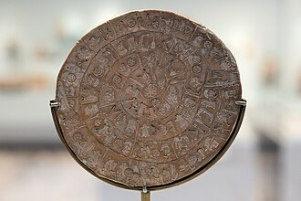

The intent is for the M_unicode module to be useful on many platforms,
but currently it is primarily [tested](TEST.md) with GCC/gfortran,Intel/ifx and flang on
Linux and Cygwin. 

# M_unicode module 
[](https://github.com/urbanjost/M_unicode/releases/tag/v1.0.0)

The **M_unicode** module provides support for directly operating on byte
streams representing UTF-8 encoded text.

A user-defined type called **unicode_type** provides an object-oriented
interface supporting ragged arrays of strings and Unicode codepoints.

In addition the procedural interface supports all basic character
intrinsics and operators.

```fortran
program testit
use, intrinsic :: iso_fortran_env, only : stdout=>output_unit

! explicit USE statements for each feature:
!
! user-defined type to hold Unicode text
use M_unicode, only : unicode_type

! convert unicode_type to CHARACTER variables
use M_unicode, only : character

! intrinsic overloads
use M_unicode, only : &
   adjustl,  adjustr,   trim,    len,     len_trim,  &
   index,    scan,      verify,  repeat,             &          
   split,    tokenize,  upper,   lower,   sort       

! operators (and overloads) and assignment
use M_unicode, only : assignment(=)
use M_unicode, only : operator(<=), lle
use M_unicode, only : operator(<),  llt
use M_unicode, only : operator(/=), lne
use M_unicode, only : operator(==), leq
use M_unicode, only : operator(>),  lgt
use M_unicode, only : operator(>=), lge
use M_unicode, only : operator(//)

! low-level text conversion to integer codepoint arrays:
use M_unicode, only : utf8_to_codepoints, codepoints_to_utf8

! sample usage:
!
implicit none
type(unicode_type)          :: ustr
character(len=*), parameter :: g='(*(g0))'
character(len=*), parameter :: gi='(*(g0,1x))'
character(len=*), parameter :: gh='(*(z0,1x))'
integer                     :: iostat

   ! preferred, but not required if not supported
   open(stdout,encoding='utf-8',iostat=iostat) 

   ! Constructors
   ! UNICODE_VARIABLE= UNICODE_VARIABLE|CHARACTER(LEN=*)|INTEGER_ARRAY
   !

   ! assign UTF-8 string to OOP object.
   ustr= 'Hello World and Ni Hao -- 你好  '

   write (stdout,g) character(ustr) ! convert to intrinsic CHARACTER variable
   write (stdout,g) len(ustr)
   write (stdout,g) len_trim(ustr)
   write (stdout,g) index(ustr,'你')

   ! OOPS
   ! VARIABLE%CHARACTER(start,end,step) returns a CHARACTER string
   ! VARIABLE%BYTE() returns an array of CHARACTER(len=1) values
   write (stdout,g)  ustr%character()      ! convert to CHARACTER variable
   write (stdout,g)  ustr%character(27,28) ! similar to LINE(27:28) for CHARACTER
   write (stdout,g)  ustr%character(len(ustr),1,-1) ! reverse string
   write (stdout,g)  ustr%byte()           ! convert to CHARACTER(LEN=1) type
   ! print 
   write (stdout,gi) ustr%codepoint()      ! convert to Unicode codepoints
   write (stdout,gh) ustr%codepoint()      ! Hexadecimal values of codepoints

end program testit
```
## Expected output:
```text
Hello World and Ni Hao -- 你好  
30
28
27
Hello World and Ni Hao -- 你好  
你好
  好你 -- oaH iN dna dlroW olleH
Hello World and Ni Hao -- 你好  
72 101 108 108 111 32 87 111 114 108 100 32 97 110 100 32 78 105 32 72 97 111 32 45 45 32 20320 22909 32 32
48 65 6C 6C 6F 20 57 6F 72 6C 64 20 61 6E 64 20 4E 69 20 48 61 6F 20 2D 2D 20 4F60 597D 20 20
```
## Unicode usage from Fortran when UTF-8 source files are supported

Fortran 2003 and later standards describe internal representation of
Unicode using 4-byte-per-character UCS-4 encoding for characters/glyphs,
including an ability to automatically encode and decode data read and
written to UTF-8 files.

__But Unicode support is optional.__

Where Unicode __is__ supported (ie. where CHARACTER(KIND="ISO_10646")
is provided)
The [M_utf8](https://github.com/urbanjost/M_utf8) repository
supplements Unicode usage -- emphasizing adherence to the standard to
promote portability.

When the compiler does __not__ support CHARACTER(KIND="ISO_10646") it
still may support UTF-8 source files and permit entering multi-byte
Unicode characters in comments and (more importantly) in constant
strings. This is now very common, as nearly all current operating systems
and many applications support UTF-8 text files.

But whether in input and output files, or as what-you-see-is-what-you-get
character constants the compiler will see this text as byte streams,
and will be unaware of how many Unicode glyphs/characters are represented.

So it may often be easy to place Unicode characters in fixed messages,
but if the text needs manipulated or processed in any way dealing with
Unicode as a raw series of 8-bit-bytes becomes complex and non-intuitive.

To keep processing of Unicode as simple as processing ASCII-7
characters the **M_unicode** module provides a user-defined type named
**UNICODE_TYPE** and a number of procedures for converting byte streams
that represent UTF8-encoded text into Unicode code points (ie, 32-bit
integer values that generally identify one specific Unicode character).

Additionally the most common character-related intrinsics and operators
are overloaded to work with the UNICODE_TYPE variables; and the type
is extended to include the procedures and operators as type-bound
procedures for programmers that prefer OOP (Object-Oriented Programming)
capabilities.

### UTF-8 source files -- just in comments and constants

The Fortran character set is the set of characters used in constructing
Fortran code. It is now the same as the ASCII 7-bit character set sans
the unprintable control characters. The letters a-z,A-Z and digits 0-9
and underscore are the only characters allowed in operator symbols. These
same characters and the "special" characters (the remaining printable
ASCII 7-bit characters) are used for operators and bracketing, and
various forms of separating and delimiting other lexical tokens.

But what about other non-ASCII-7 characters representable by the
processor?  Possibilities include the extended ASCII characters or
multi-byte characters as defined for UTF-8 text files. The standard
states that, whatever those "additional characters" are, they may appear
in character constants:

    6.1.6   Other characters

    Additional characters may be representable in the processor, but
    shall appear only in comments (6.3.2.3, 6.3.3.2), character constants
    (7.4.4), input/output records (12.2.2), and character string edit
    descriptors (13.3.2).

Since ASCII-7-bit is a subset of UTF-8 it is very likely that if your
system supports UTF-8 files that it therefore will allow multi-byte
characters to be represented in comments and character constants.

But it is up to the processor whether it supports or even allows
UTF-8 files.  In the past when UTF-8 file support was rare this meant
using UTF-8 multi-byte characters in source files was likely to be very
non-portable.  Now that UTF-8 files are supported on most systems this
extension can be useful, particularly with compilers that do not support
UCS-4 yet.

### NOTE:

__If concerned about directly placing multi-byte characters into constant
strings directly in the code, support of arrays of codepoint values is
supported as well__.

### Environment

Reading and writing properly to the screen requires that, independent
of the **M_unicode** module, UTF-8 files display properly.

This may require selecting a specific terminal emulator, setting the locale
and selecting a font that supports the Unicode characters of interest.

Without using any Fortran Unicode support features, if the output
is redirected to a file does it appear correctly?

```fortran
program multibyte
use, intrinsic :: iso_fortran_env, only : stdout=>output_unit
character(len=*),parameter :: all='(*(g0))'
integer :: iostat
   open(stdout,encoding='utf-8',iostat=iostat) ! if not supported try removing
   write(stdout,'(a)') &
   'Confucius never claimed to be a prophet, '       ,&
   'but I think he foresaw AI! He said '             ,&
   ''                                                ,&
   ' "学而不思则罔，思而不学则殆"'                   ,&
   'or'                                              ,&
   ' (xué ér bù sī zé wǎng, sī ér bù xué zé dài),'   ,&
   'which is also'                                   ,&
   ' "To learn without thinking is to be lost, '     ,&
   ' to think without learning is to be in danger".'
end program multibyte
```
Does the text display properly when written to the screen?  If it does
not you need to determine how to set up a terminal on your system to
display UTF-8 data, which is system dependent.

Remember that unless the compiler directly supports UTF-8 representation (
so far I have identified no compilers that do so) these strings are seen
by the compiler as a string of bytes, and it is otherwise unaware they
represent Unicode characters. If they are just to be read and written
as-is as in the previous example program that is not a major concern;
but if you are manipulating or processing the strings in significant
ways you probably want to load the **M_unicode** module and convert the
strings to TYPE(UNICODE_TYPE)

## Summary

Yes, a Fortran source file can contain multibyte Unicode characters in
most environments, but the level of support and how they are handled
depends on the specific Fortran compiler and operating system and is
not otherwise defined by the Fortran standard.

The appearance of multi-byte characters in comments and character
constants is typically all that is allowed and compiler errors occur
when unsupported characters outside the Fortran character set are used
in the body of the code -- unless the vendor extends Fortran beyond the
requirements of the Fortran standard. It is assumed here that is not the
case; so be careful that outside of quoted strings and comments that only
ASCII-7-bit characters are used to write the actual coding instructions.

Some editors might try to be "helpful" and change ASCII quote and dash
characters to other multi-byte characters when editing UTF-8 files, so
be aware you might need to normalize your source files into the allowed
Fortran character set outside of constant strings.

When using Unicode as byte streams avoid list-directed output. It
does not know which bytes are composing a glyph and may split lines at
inappropriate points.

### Compiler Support:

   Even with standard features, compiler support for Unicode in source
   files can vary. Some compilers might require specific flags (e.g.,
   -qmbcs for XL Fortran) or might offer better integration with
   system-level Unicode functionalities.

### Source File Encoding:

   The encoding of the Fortran source file itself is crucial. If the
    file is saved in a Unicode encoding like UTF-8, the compiler needs
   to be able to correctly interpret these characters during compilation.

### Limitations:

While modern Fortran can handle Unicode characters, there might still be
limitations compared to languages like C++ regarding the ease of use with
complex Unicode features (e.g., surrogate pairs, text directionality,
normalization). For many uses of Unicode support of codepoints and system
support fort UTF-8 encoding is sufficient, however.

### In summary:

While it is possible to include multibyte Unicode characters in Fortran
source files, especially with modern Fortran standards and supportive
compilers, it requires careful consideration of the compiler's
capabilities and the source file's encoding.

 ## References
 * [](https://home.unicode.org/)

 * Initially based on a discussion begun in
https://fortran-lang.discourse.group/t/how-to-use-utf-8-in-gfortran/9949, 2025-08;
including features and enhancements from Francois Jacq.

 * The improvements include procedures for handling ASCII encoding extensions
   often used for internationalization that pre-date Unicode, such as the
   Latin encodings now in module
   [M_isolatin](https://github.com/urbanjost/M_isolatin).

-------------------------------------------------------------
## See Also

 + [https://fortran-lang.discourse.group/t/how-to-use-utf-8-in-gfortran/9949](https://fortran-lang.discourse.group/t/how-to-use-utf-8-in-gfortran/9949)
 + [https://fortran-lang.discourse.group/t/how-do-i-file-read-french-special-characters-like-e-etc/6618](https://fortran-lang.discourse.group/t/how-do-i-file-read-french-special-characters-like-e-etc/6618)
 + [https://fortran-lang.discourse.group/t/using-unicode-characters-in-fortran/2764](https://fortran-lang.discourse.group/t/using-unicode-characters-in-fortran/2764)
<!--
 + [UTF-8 Everywhere Manifesto](http://utf8everywhere.org/)
-->
