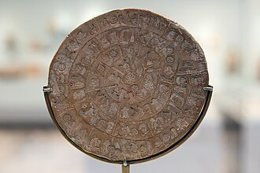

[](https://fpm.fortran-lang.org/registry/package/m_unicode)
<!--
[](https://github.com/urbanjost/M_unicode/actions)
[](https://github.com/urbanjost/M_unicode)
-->

# M_unicode module
<!--
[](https://github.com/urbanjost/M_unicode/releases/tag/v2.0.0)
-->
[](https://urbanjost.github.io/M_unicode/man3.html)

## Overview

The **M\_unicode** module provides direct support for UTF-8 encoded
data in source files and internal I/O, not just UTF-8 encoded external data files.
It allows UTF-8 encoded strings to be processed as easily as ASCII-7
encoded strings, without depending on a compiler supporting the
optional ISO_10646 Unicode extension.

### Not just for UTF-8

ASCII-7 being a subset of UTF-8 the procedures work with standard ASCII-7
text as well.

### Supports intrinsics and more

The procedural interface provided by **M\_unicode** overloads and
supports all the basic character intrinsics and operators. The module
extends this functionality with many additional string methods such as
case conversion and sorting as well.

### OOPs, lets do it again ..

There is also an OOP interface. The user-defined type **unicode\_type**
provides not just ragged arrays of strings but nearly all the string
methods as type-bound procedures.

### The Where and the Why ...

**M\_unicode** is a companion to and fully implements the UTF-8
processing discussed in the Fortran Wiki [Unicode
Tutorial](https://fortranwiki.org/fortran/show/Unicode).

### Proviided with Unit-testing and extensive examples

Over 55 [example programs](example) and a self-contained set of unit
tests are included.

### Documentation

The procedures are described in HTML, \*roff and flat-text format.
The \*roff files may be installed as man-pages on Unix and GNU/Linux
platforms.

### Example

A sample program explicitly accessing all the module elements by
name:
```fortran
program testit
use, intrinsic :: iso_fortran_env, only : stdout=>output_unit

! explicit USE statements for each feature:
!
! user-defined type to hold Unicode text
use M_unicode, only : unicode_type

! convert unicode_type to CHARACTER variables
use M_unicode, only : character

! intrinsic overloads
use M_unicode, only : &
   adjustl,  adjustr,   trim,    len,     len_trim,  &
   index,    scan,      verify,  repeat,  ichar,     &
   split,    tokenize

! additional methods
use M_unicode, only : &
   upper,   lower,          glob,             &
   isascii, isblank,        isspace,          &
   slurp,   readline,       pound_to_box,     &
   sort,    expandtabs,     replace,          &
   pad,     join,           fmt,              &
   get_arg, get_env,        transliterate,    &
   escape,  add_backslash,  sub

! Note operators (and overloads) and SORT(3f) use Unicode codepoint 
! order (NOT necessarily dictionary order):

use M_unicode, only : assignment(=)
use M_unicode, only : operator(<=), lle
use M_unicode, only : operator(<),  llt
use M_unicode, only : operator(/=), lne
use M_unicode, only : operator(==), leq
use M_unicode, only : operator(>),  lgt
use M_unicode, only : operator(>=), lge
use M_unicode, only : operator(//)

! low-level conversion betwwen utf-8 text and integer codepoint arrays:
use M_unicode, only : utf8_to_codepoints, codepoints_to_utf8

! sample usage:
!
implicit none
type(unicode_type)          :: ustr
character(len=*), parameter :: g='(*(g0))', &
                               gi='(*(g0,1x))', &
                               gh='(*(z0,1x))'
integer                     :: iostat

   ! Constructors
   ! UNICODE_VARIABLE= UNICODE_VARIABLE|CHARACTER(LEN=*)|INTEGER_ARRAY

   ! assign UTF-8 string to OOP object.
   ustr= 'Hello World and Ni Hao -- 你好  '

   write (stdout,g) character(ustr) ! convert to intrinsic CHARACTER variable
   write (stdout,g) len(ustr)
   write (stdout,g) len_trim(ustr)
   write (stdout,g) index(ustr,'你')

   ! OOPS
   ! VARIABLE%CHARACTER(start,end,step) returns a CHARACTER string
   ! VARIABLE%BYTE() returns an array of CHARACTER(len=1) values
   write (stdout,g)  ustr%character()      ! convert to CHARACTER variable
   write (stdout,g)  ustr%character(27,28) ! similar to LINE(27:28) for CHARACTER
   write (stdout,g)  ustr%character(len(ustr),1,-1) ! reverse string
   write (stdout,g)  ustr%byte()           ! convert to CHARACTER(LEN=1) type
   ! print
   write (stdout,gi) ustr%codepoint()      ! convert to Unicode codepoints
   write (stdout,gh) ustr%codepoint()      ! Hexadecimal values of codepoints

end program testit
```
## Expected output:
```text
Hello World and Ni Hao -- 你好
30
28
27
Hello World and Ni Hao -- 你好
你好
  好你 -- oaH iN dna dlroW olleH
Hello World and Ni Hao -- 你好
72 101 108 108 111 32 87 111 114 108 100 32 97 110 100 32 78 105 32 72 97 111 32 45 45 32 20320 22909 32 32
48 65 6C 6C 6F 20 57 6F 72 6C 64 20 61 6E 64 20 4E 69 20 48 61 6F 20 2D 2D 20 4F60 597D 20 20
```
## Details

### Optional Unicode ISO-10646 Fortran extension

Fortran 2003 and later standards
describe the optional Unicode ISO-10646 extension, which provides for
an internal representation of Unicode using 4-byte-per-character UCS-4
encoding for characters/glyphs, as well as an ability to automatically
encode and decode data read and written to UTF-8 files.

__But__
 + major compilers still do not support the Unicode ISO-10646 option
 + use of UTF-8 strings in source code is treated as ASCII-8 byte streams,
   not as UCS-4 
 + there are no functions provided to convert from UCS-4 to UTF-8 byte
   streams except via reading and writing to external files (__not__
   internal files!)..
 + ragged string arrays are not supported as intrinsic types
 + no OOP interface is provided for the intrinsic methods 

The **M\_unicode** module resolves all these issues.

However, if interested in using CHARACTER(KIND="ISO_10646") the
[M_ucs4](https://github.com/urbanjost/M_ucs4) repository supplements
ISO_10646 usage -- and it emphasizes adherence to the standard to
promote portability.

## Summary
By default it can often be easy to place UTF-8 characters in fixed
messages, but if the text needs manipulated or processed in any way
programattically dealing with Unicode UTF-8 encoded data as a raw series
of 8-bit-bytes becomes complex and non-intuitive.  The **M_unicode**
module provides a user-defined type named **UNICODE_TYPE** and many
procedures that make it very easy to work with such multi-byte characters.

### Limits on UTF-8 source files 

Note that UTF-8 characters are supported in the source files just in
comments and values. This is sufficient, but requires you not use
multi-byte characters in the executable code itself, even in variable
names.

All code statements and expressions other than string values must use
just the Fortran character set.

Per the Fortran Standard the __Fortran character set__ is the set of
characters used in constructing Fortran code. It is now the same as the
ASCII 7-bit character set sans the unprintable control characters. The
letters a-z,A-Z and digits 0-9 and underscore are the only characters
allowed in operator symbols. These same characters and the "special"
characters (the remaining printable ASCII 7-bit characters) are used for
operators and bracketing, and various forms of separating and delimiting
other lexical tokens.

But what about other non-ASCII-7 characters representable by the
processor?  Possibilities include the extended ASCII characters or
multi-byte characters as defined for UTF-8 text files. The standard
states that, whatever those "additional characters" are, they may appear
in character constants:

    6.1.6   Other characters

    Additional characters may be representable in the processor, but
    shall appear only in comments (6.3.2.3, 6.3.3.2), character constants
    (7.4.4), input/output records (12.2.2), and character string edit
    descriptors (13.3.2).

Since ASCII-7-bit is a subset of UTF-8 it is very likely that if your
system supports UTF-8 files that it therefore will allow multi-byte
characters to be represented in comments and character constants.

But it is up to the processor whether it supports or even allows
UTF-8 files. In the past when UTF-8 file support was rare this meant
using UTF-8 multi-byte characters in source files was likely to be
non-portable. Now that UTF-8 files are supported on most systems this
extension can be useful, particularly with compilers that do not support
UCS-4 yet.

### NOTE:

__If concerned about directly placing multi-byte characters into constant
strings directly in the code, support of arrays of codepoint values
is supported as well as C-style escape sequences and HTML character
entities__.

### Environment

Reading and writing properly to the screen requires that, independent
of the **M_unicode** module, UTF-8 files display properly.

This may require selecting a specific terminal emulator, setting the
locale and selecting a font that supports the Unicode characters of
interest.

Using the following Fortran source file, which does not use any Fortran
Unicode ISO-10646 extensions, does the output appear directly if
redirected to a file?

```fortran
program multibyte
use, intrinsic :: iso_fortran_env, only : stdout=>output_unit
character(len=*),parameter :: all='(*(g0))'
integer :: iostat
   write(stdout,'(a)') &
   'Confucius never claimed to be a prophet, '       ,&
   'but I think he foresaw AI! He said '             ,&
   ''                                                ,&
   ' "学而不思则罔，思而不学则殆"'                   ,&
   'or'                                              ,&
   ' (xué ér bù sī zé wǎng, sī ér bù xué zé dài),'   ,&
   'which is also'                                   ,&
   ' "To learn without thinking is to be lost, '     ,&
   ' to think without learning is to be in danger".'
end program multibyte
```
Does the text display properly when written to the screen?  If it does
not you need to determine how to set up a terminal on your system to
display UTF-8 data, which is system dependent.

Remember that unless the compiler directly supports UTF-8 representation (
so far I have identified no compilers that do so) these strings are seen
by the compiler as a string of bytes, and it is otherwise unaware they
represent Unicode characters. If they are just to be read and written
as-is as in the previous example program that is not a major concern;
but if you are manipulating or processing the strings in significant
ways is when you use the **M_unicode** module.

---

---

## Documentation Details

### User

   There are descriptions of each procedures in the style of man-pages in four formats:

 - An [index](https://urbanjost.github.io/M_unicode/man3.html) to the HTML versions
   of the man-pages.

 - A [flat text version](https://urbanjost.github.io/M_unicode/manual.txt) of the man-pages

 - A single page (that uses javascript) combining all the HTML descriptions of the man-pages
   for easy searching and printing:
   [BOOK_M_unicode](https://urbanjost.github.io/M_unicode/BOOK_M_unicode.html).

 -  man-page archives for installation on GNU/Linux, Unix and CygWin platforms:
    + [manpages.zip](https://urbanjost.github.io/M_unicode/manpages.zip)
    + [manpages.tgz](https://urbanjost.github.io/M_unicode/manpages.tgz)
 - [CHANGELOG](docs/CHANGELOG.md) provides a history of significant changes

### Developer

 - The code was run through [ford(1)](https://politicalphysicist.github.io/ford-fortran-documentation.html)
   to produce a [developers' document](https://urbanjost.github.io/M_unicode/fpm-ford/index.html).
 - [github action status](docs/STATUS.md)

---

---

## Demo Programs

Each man-page includes a working example program. These and additional
examples are included in the [example/](example/) directory.


## Download and Build with Make(1)
   Compile the M_unicode module and build all the example programs.
```bash
   git clone https://github.com/urbanjost/M_unicode.git
   cd M_unicode/src
   # change Makefile if not using one of the listed compilers

   make clean gfortran|ifx|ifort|nvfortran|nagfor

   # or 
   make clean
   make F90=<compiler> F90FLAGS=<flags>

   # display other options (test, run, doxygen, ford, ...)
   make help
```
   To install you then generally copy the *.mod file and *.a file to
   an appropriate directory. Unfortunately, the specifics vary but in
   general if you have a directory $HOME/.local/lib and copy those files
   there then you can generally enter something like
```bash
     gfortran -L$HOME/.local/lib -lM_unicode  myprogram.f90 -o myprogram
```
   There are different methods for adding the directory to your default
   load path, but frequently you can append the directory you have
   placed the files in into the colon-separated list of directories
   in the $LD_LIBRARY_PATH or $LIBRARY_PATH environment variable, and
   then the -L option will not be required (or it's equivalent in your
   programming environment).
```bash
       export LD_LIBRARY_PATH=$HOME/.local/lib:$LD_LIBRARY_PATH
```
   **NOTE**: If you use multiple Fortran compilers you may need to create
   a different directory for each compiler. I would recommend it, such
   as $HOME/.local/lib/gfortran/.

### Creating a shared library

   If you desire a shared library as well, for gfortran you may enter
```bash
     make clean gfortran gfortran_install
```
   and everything needed by gfortran will be placed in libgfortran/ that
   you may add to an appropriate area, such as $HOME/.local/lib/gfortran/.
```bash
     make clean ifort ifort_install # same for ifort
```
   does the same for the ifort compiler and places the output in libifort/.
### Specifics may vary

   NOTE: The build instructions above are specific to a ULS (Unix-Like
   System) and may differ, especially for those wishing to generate shared
   libraries (which varies significantly depending on the programming
   environment). For some builds it is simpler to make a Makefile for
   each compiler, which might be required for a more comprehensive build
   unless you are very familiar with gmake(1).

   If you always use one compiler it is relatively simple, otherwise
   make sure you know what your system requires and change the Makefile
   as appropriate.


## Build with FPM
   Alternatively, fpm(1) users may download the github repository and build it with
   fpm ( as described at [Fortran Package Manager](https://github.com/fortran-lang/fpm) )
```bash
        git clone https://github.com/urbanjost/M_unicode.git
        cd M_unicode
        fpm test   # build and test the module
        fpm install # install the module (in the default location)
```
   or just list it as a dependency in your fpm.toml project file.
```toml
        [dependencies]
        M_unicode        = { git = "https://github.com/urbanjost/M_unicode.git" }
```
---

---
## Download and Build using cmake

To download the github repository and build and install with cmake
(you may wish to change the install path in src/CMakeLists.txt first) :
```bash
      git clone https://github.com/urbanjost/M_unicode.git
      cd M_unicode

      # Create a Build Directory:
      mkdir -p build

      cd build
      cmake -S ../src -B .

      # Configure the Build, specifying your preferred compiler (ifort, flang, etc.):
      cmake . -DCMAKE_Fortran_COMPILER=gfortran

      # Build the Project:
      cmake --build .

      #This creates:
      #
      #    build/lib/libM_unicode.a (the static library).
      #    build/include/*.mod (module files).
      #    build/test/* (test executables).
      #    build/example/* (example executables).

      # OPTIONAL SECTION:

      # Verify build
      ls build/lib/libM_unicode.a
      ls build/include/*.mod
      ls build/test/*
      ls build/example/*

      #Optionally Run Tests and Examples:
      for name in ./test/* ./example/*
      do
         $name
      done

      #Install (Optional):
      # This installs the library and module files to the system
      # (e.g., /usr/local/lib/ and /usr/local/include/).
      cmake --install .

      # if you have insufficient permissions sudo(1) may be required
      # to perform the install
      #sudo cmake --install .

      # Verify installation
      ls /usr/local/lib/libM_unicode.a
      ls /usr/local/include/*.mod

      # Cleaning Up: To clean artifacts, remove the build/ directory:
      rm -rf build
```

## Supports Meson
   Alternatively, meson(1) users may download the github repository and build it with
   meson ( as described at [Meson Build System](https://mesonbuild.com/) )
```bash
        git clone https://github.com/urbanjost/M_unicode.git
        cd M_unicode
        meson setup _build
        meson test -C _build  # build and test the module

        # install the module (in the <DIR> location)
        # --destdir is only on newer versions of meson
        meson install -C _build --destdir <DIR>
        # older method if --destdir is not available
        env DESTDIR=<DIR> meson install -C _build
```
   or just list it as a [subproject dependency](https://mesonbuild.com/Subprojects.html) in your meson.build project file.
```meson
        M_unicode_dep = subproject('M_unicode').get_variable('M_unicode_dep')
```
## Summary

Yes, a Fortran source file can contain multibyte Unicode characters in
most environments, but the level of support and how they are handled
depends on the specific Fortran compiler and operating system and is
not otherwise defined by the Fortran standard.

The appearance of multi-byte characters in comments and character
constants is typically all that is allowed and compiler errors occur
when unsupported characters outside the Fortran character set are used
in the body of the code -- unless the vendor extends Fortran beyond the
requirements of the Fortran standard. It is assumed here that is not the
case; so be careful that outside of quoted strings and comments that only
ASCII-7-bit characters are used to write the actual coding instructions.

Some editors might try to be "helpful" and change ASCII quote and dash
characters to other multi-byte characters when editing UTF-8 files, so
be aware you might need to normalize your source files into the allowed
Fortran character set outside of constant strings.

When using Unicode UTF-8 encoded data (as byte streams) avoid
list-directed output. It does not know which bytes are composing a glyph
and may split lines at inappropriate points.

### Compiler Support:

   Even with standard features, compiler support for Unicode in source
   files can vary. Some compilers might require specific flags (e.g.,
   -qmbcs for XL Fortran) or might offer better integration with
   system-level Unicode functionalities.

### Limitations:

While modern Fortran can handle Unicode characters, there might still be
limitations compared to languages like C++ regarding the ease of use with
complex Unicode features (e.g., surrogate pairs, text directionality,
normalization). For many uses of Unicode support of codepoints and system
support for UTF-8 encoding is sufficient, however.

### References
 * [](https://home.unicode.org/)


 * Initially based on a discussion begun in
https://fortran-lang.discourse.group/t/how-to-use-utf-8-in-gfortran/9949, 2025-08;
including features and enhancements from Francois Jacq.

 * The improvements include procedures for handling ASCII encoding extensions
   often used for internationalization that pre-date Unicode, such as the
   Latin encodings now in module
   [M_isolatin](https://github.com/urbanjost/M_isolatin).

-------------------------------------------------------------
## See Also
 + [uni.f90](https://github.com/lockstockandbarrel/mars/blob/main/bootstrap/uni.f90) is a stand-alone single source file
   that builds a utility program for manipulating Unicode data in UTF-8 files; demonstrating various aspects of M_unicode.

As already mentioned ...

 + [https://fortranwiki.org/fortran/show/Unicode](https://fortranwiki.org/fortran/show/Unicode)
 + The [M_unicode](https://github.com/urbanjost/M_unicode) repository for using UTF-8 files from Fortran
 + The [M_ucs4](https://github.com/urbanjost/M_ucs4) repository for use with the optional ISO-10646 Fortran extension
 + [M_isolatin](https://github.com/urbanjost/M_isolatin)

Additionally ...

 + [M_strings](https://github.com/urbanjost/M_strings) for ASCII string procedures
 + [M_io](https://github.com/urbanjost/M_io) for filesystem and I/O related functions
 + [M_attr](https://github.com/urbanjost/M_attr) for ANSI terminal color and attributes
 + iconv  -- a program and library for converting between text encodings.
   use "iconv --list" on ULS to see the list of encodings supported.
   One use of iconv(1) is to convert "Latin" encodings to UTF-8 encodings
   for direct use by the M_unicode(3) module.
<!--
 + [https://fortran-lang.discourse.group/t/how-to-use-utf-8-in-gfortran/9949](https://fortran-lang.discourse.group/t/how-to-use-utf-8-in-gfortran/9949)
 + [https://fortran-lang.discourse.group/t/how-do-i-file-read-french-special-characters-like-e-etc/6618](https://fortran-lang.discourse.group/t/how-do-i-file-read-french-special-characters-like-e-etc/6618)
 + [https://fortran-lang.discourse.group/t/using-unicode-characters-in-fortran/2764](https://fortran-lang.discourse.group/t/using-unicode-characters-in-fortran/2764)
 + [UTF-8 Everywhere Manifesto](http://utf8everywhere.org/)
-->
## Note:
The UDDTIO (User-Defined Derived-Type Input/Output) procedures for use
with the DT edit descriptor are still undergoing development. This 
feature is not supported by several major compilers at this time so it
is conditionally removed from the M_unicos module if the compiler has
not been tested with the feature, meaning a major number of the 
example files will need removed or modified on such platforms, although
the main module and unit test will curently run without UDDTIO.
